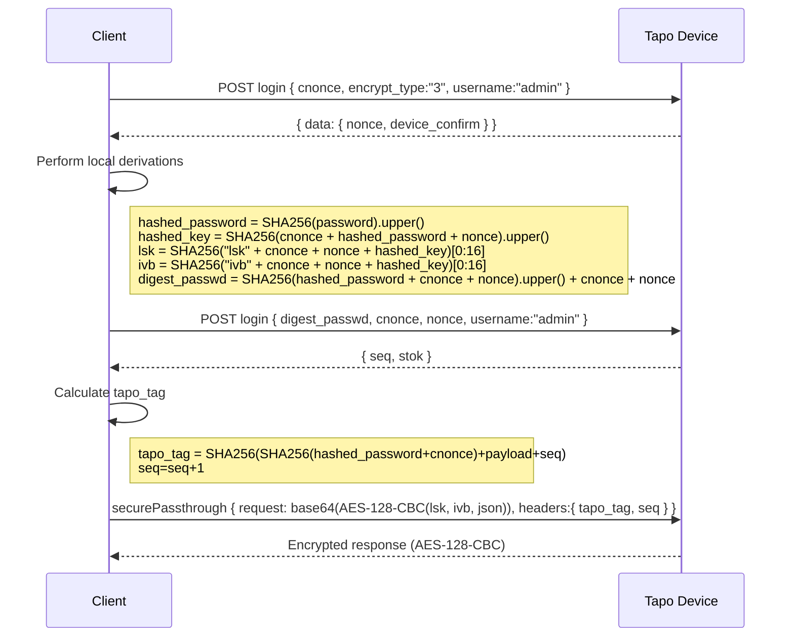

# Tapo-Onboarding

> For a deeper dive into the motivations and tribulations of this project, see the [blog post](https://kennedn.com/blog/tapo).

Tools and notes for onboarding TP-Link Tapo cameras that use the v3 encryption method **without cloud dependency**. This repo contains:

* Bash clients that perform the two-phase login, derive AES keys, build `securePassthrough` requests, and decrypt the responses.
* A `mitmproxy` addon + content view that automatically decrypts, dumps and pretty-prints Tapo traffic during interactive RE.

---

## Contents

```bash
├── tapo_decrypt_pretty.py     # mitmproxy addon: handshake tracking + AES decrypt + inline view
├── tapo_onboard.sh            # Full onboarding script: Wi-Fi, RTSP/ONVIF, logo disable, password changes
├── tCurl.sh                   # Minimal script: login + send arbitrary requests
└── README.md
```
---

## Cloudless Onboarding (`tapo_onboard.sh`)

This script performs a complete onboard for a Tapo Camera:

* Login with the default password
* Scan for Wi-Fi and interactively select an AP
* Disable the OSD logo overlay
* Setup the RTSP/ONVIF “third account” with username `tapoadmin` and the supplied password
* Change the Tapo API admin password to the supplied password
* Re-login with the supplied password
* Connect the camera to the selected Wi-Fi network

### Prerequisites

* Linux/Mac with Bash, `jq`, `curl`, `openssl`, `fzf`, `column`

### Usage

Connect to the Wifi access point of the tapo device.

Run script:

```bash
./tapo_onboard.sh <camera-host-or-ip> <new_password>
```

Example:

```bash
❯ ./tapo_onboard.sh 192.168.191.1 'MyNewPassword123'
Scanning for Wifi access points...
Disable tapo logo
Configure RTSP / ONVIF account
Change tapo API admin password
Connecting to access point
```

---

## Arbitrary Requests (`tCurl.sh`)

This minimal script logs in with the provided password, then sends a raw JSON request array (as used in Tapo’s `multipleRequest`) and prints the decrypted response.

### Prerequisites

* Linux/Mac with Bash, `jq`, `curl`, `openssl`

### Usage

```bash
./tCurl.sh <camera-host-or-ip> <password> '<requests-json-array>'
```

Example:

```bash
❯ ./tCurl.sh 192.168.1.165 'REDACTED' \
  '[{"method":"getDeviceInfo","params":{"system":{"get_device_info":{}}}}]' | jq
{
  "result": {
    "responses": [
      {
        "method": "getDeviceInfo",
        "result": {
          "device_info": {
            "basic_info": {
              "device_type": "SMART.IPCAMERA",
              "device_model": "TC70",
              "sw_version": "1.2.3 Build 250610 Rel.50539n",
              "device_name": "TC70 5.0",
              "region": "EU",
              ...
            }
          }
        },
        "error_code": 0
      }
    ]
  },
  "error_code": 0
}
```

---

## Protocol Diagram


---

## Capturing onboarding calls from Tapo App

The default password for encrypt v3 firmwares is:

`TPL075526460603`

This can be used to dump all of the calls made to the device during on-boarding in the tapo app. `tapo_decrypt_pretty.py` hardcodes this password and uses it to decrypt in-flight packets between the tapo app and a tapo device.

### Setup

Install dependencies:

```bash
python -m venv .venv
. .venv/bin/activate
pip install pycryptodome mitmproxy frida-tools
````

Run mitmproxy once to generate certificates:

```bash
mitmproxy
```

Download httptoolkit's frida scripts:

```bash
git clone https://github.com/httptoolkit/frida-interception-and-unpinning.git
cd frida-interception-and-unpinning
```

Place mitmproxy certificate in `config.js`:

```bash
cat ~/.mitmproxy/mitmproxy-ca-cert.pem | clipcopy
vi config.js
# Paste contents into CERT_PEM variable
```

Enable ADB debugging on target device.

Install / Login to Tapo APK on target device.

Connect target device to computer via USB, allow USB debugging and ensure it shows up as a device in adb:

```bash
adb devices
```

Output:

```bash
❯ adb devices
List of devices attached
JELLY20000030775        device
```

Download latest frida-server (in this case for android-arm64 target):

```bash
curl -L "$(curl -s https://api.github.com/repos/frida/frida/releases/latest | jq -r '.assets[] | select(.name|test("frida-server.*android.*arm64")) | .browser_download_url')" | xz -d > frida-server
```

Push frida-server to target device and run (requires a rooted android phone or emulator):

```bash
adb push frida-server /data/local/tmp && adb shell "su -c ss -ltnpK 'sport = 27042' && su -c chmod 755 /data/local/tmp/frida-server && su -c /data/local/tmp/frida-server" &
```

Forward port 8000 from device to computer:

```bash
adb reverse tcp:8000 tcp:8000
```

### Running

In one terminal, run mitmproxy capture:

> NOTE: Part way through onboarding, the tapo device password is changed to match the cloud password for the given account. Therefore to decrypt all packets, the cloud password must be supplied in the TAPO\_PASSWORD environment variable.

```bash
cd tapo-onboarding
TAPO_PASSWORD='your_cloud_password' mitmproxy --listen-port 8000 --ssl-insecure --view-filter "~hq User-Agent:.*Tapo.*CameraClient.*Android" -s tapo_decrypt_pretty.py
```

In another terminal, inject frida scripts / launch Tapo app:

```bash
cd ../frida-interception-and-unpinning
frida -U \
    -l ./config.js \
    -l ./android/android-proxy-override.js \
    -l ./android/android-system-certificate-injection.js \
    -l ./android/android-certificate-unpinning.js \
    -l ./android/android-certificate-unpinning-fallback.js \
-f com.tplink.iot
```

Connect the computer running mitmproxy to the Tapo device’s Access Point.

Add new device in Tapo app:

https://github.com/user-attachments/assets/0ea26278-5c9d-4d06-bbce-20498fcc595f

The onboarding calls should be captured in mitmproxy:


The `tapo_decrypt_pretty.py` script will add `request_decrypted` and `response_decrypted` fields in-line whilst in the mitmproxy TUI:


Additionally, session state and call details are dumped to a `tapo_capture_<host>.json` file for analysis outside of the mitmproxy TUI.

