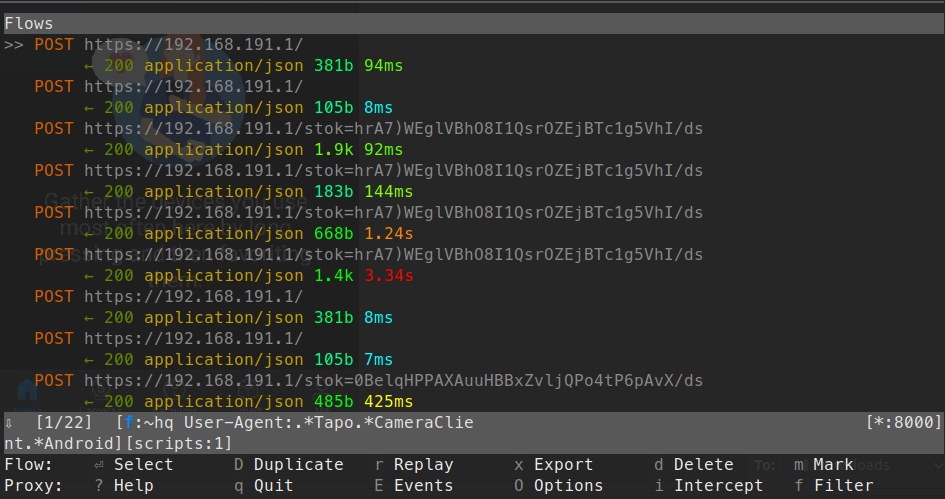
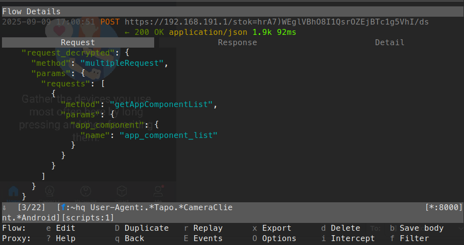

# Tapo-Onboarding

Tools and notes for onboarding TP-Link Tapo cameras that use the v3 encryption method **without cloud dependency**. This repo contains:

* A `mitmproxy` addon + content view that automatically decrypts, dumps and pretty-prints Tapo traffic during interactive RE.
* A PoC Bash client that performs the two-phase login, derives AES keys, builds a `securePassthrough` request, and decrypts the response.

---

## Contents

```
.
├── tapo_decrypt_pretty.py     # mitmproxy addon: handshake tracking + AES decrypt + inline view
├── tapo_login.sh              # PoC login + encrypted request/response test
└── README.md
```

---

## Protocol Overview (high level)

1. Client POSTs `{"method":"login","params":{"cnonce":...,"encrypt_type":"3","username":"admin"}}`.
2. Device replies with `{ data: { nonce, device_confirm } }`.
3. Client validates `device_confirm` and derives:

   * `hashed_password = SHA256(password).upper()`
   * `hashed_key = SHA256(cnonce + hashed_password + nonce).upper()`
   * Session tokens:
     `lsk = SHA256("lsk" + cnonce + nonce + hashed_key)[0:16]`
     `ivb = SHA256("ivb" + cnonce + nonce + hashed_key)[0:16]`
4. Client sends second `login` with `digest_passwd = SHA256(hashed_password + cnonce + nonce).upper() + cnonce + nonce`.
5. Subsequent API calls go via `{"method":"securePassthrough","params":{"request": base64(AES-128-CBC(lsk, ivb, json))}}` and are accompanied by `tapo_tag`/`seq` headers.

---


## Capturing onboarding calls from Tapo App


The default password for encrypt v3 firmwares is:

```
TPL075526460603
```

This can be used to dump all of the calls made to the device during on-boarding in the tapo app. `tapo_decrypt_pretty.py` hardcodes this password and uses it to decrypt in-flight packets between the tapo app and a tapo device.

### Setup

Install dependancies

```bash
python -m venv .venv
. .venv/bin/activate
pip install pycryptodome mitmproxy frida-tools
```

Run mitmproxy once to generate certificates:

```bash
mitmproxy
```

Download httptoolkit's frida scripts

```bash
git clone https://github.com/httptoolkit/frida-interception-and-unpinning.git
cd frida-interception-and-unpinning
```

Place mitmproxy certificate in config.js:

```bash
cat ~/.mitmproxy/mitmproxy-ca-cert.pem | clipcopy
vi config.js
# Paste contents into CERT_PEM variable
```

Enable ADB debugging on target device

Install / Login to Tapo APK on target device

Connect target device to computer via USB, allow USB debugging and ensure it shows up as a device in adb:

```bash
adb devices
```

Output:

```bash
❯ adb devices
List of devices attached
JELLY20000030775        device
```

Download latest frida-server (in my case for android-arm64 target):

```bash
curl -L "$(curl -s https://api.github.com/repos/frida/frida/releases/latest | jq -r '.assets[] | select(.name|test("frida-server.*android.*arm64")) | .browser_download_url')" | xz -d > frida-server
```

Push frida-server to target device and run (requires a rooted android phone or emulator):

```bash
adb push frida-server /data/local/tmp && adb shell "su -c ss -ltnpK 'sport = 27042' && su -c chmod 755 /data/local/tmp/frida-server && su -c /data/local/tmp/frida-server" &
```

Forward port 8000 from device to computer:

```bash
adb reverse tcp:8000 tcp:8000
```

### Running

In one terminal, run mitmproxy capture:

> NOTE: Part way through onboarding, the tapo device password is changed to match the cloud password for the given account. Therefore to decrypt all packets, the cloud password must be supplied in the TAPO_PASSWORD environment variable.

```bash
cd tapo-onboarding
TAPO_PASSWORD='your_cloud_password' mitmproxy --listen-port 8000 --ssl-insecure --view-filter "~hq User-Agent:.*Tapo.*CameraClient.*Android" -s tapo_decrypt_pretty.py
```

In another terminal, inject frida scripts / launch Tapo app:

```bash
cd ../frida-interception-and-unpinning
frida -U \
    -l ./config.js \
    -l ./android/android-proxy-override.js \
    -l ./android/android-system-certificate-injection.js \
    -l ./android/android-certificate-unpinning.js \
    -l ./android/android-certificate-unpinning-fallback.js \
-f com.tplink.iot
```

Connect the computer running mitmproxy to the Tapo devices Access Point

Add new device in Tapo app:

https://github.com/user-attachments/assets/0ea26278-5c9d-4d06-bbce-20498fcc595f

The onboarding calls should be captured in mitmproxy:



The `tapo_decrypt_pretty.py` script will add `request_decrypted` and `response_decrypted` fields in-line whilst in the mitmproxy TUI:



Additionally session state and call details are dumped to a `tapo_capture_<host>.json` file for analysis outside of the mitmproxy TUI.

## Login & Request (tapo\_login.sh)

The script performs login, derives keys, requests `getDeviceInfo`, and decrypts the `securePassthrough` result.

### Prerequisites

* Linux/Mac with Bash, `jq`, `curl`, `openssl`

### Usage

```bash
./tapo_login.sh <camera-host-or-ip> '<camera-password>'
```

Example:

```bash
❯ ./tapo_login.sh 192.168.1.165 'REDACTED' | jq
{
  "result": {
    "responses": [
      {
        "method": "getDeviceInfo",
        "result": {
          "device_info": {
            "basic_info": {
              "device_type": "SMART.IPCAMERA",
              "device_info": "TC70 5.0 IPC",
              "features": 3,
              "barcode": "",
              "device_model": "TC70",
              "sw_version": "1.2.3 Build 250610 Rel.50539n",
              "device_name": "TC70 5.0",
              "hw_version": "5.0",
              "device_alias": "Tapo_Camera",
              "mobile_access": "0",
              "mac": "8C-90-2D-5E-7E-7F",
              "dev_id": "802172332B2ACF4620BDE5F1E0629A07238CECE2",
              "hw_id": "01C6C3DBADBB4123DA27732B1953F196",
              "oem_id": "B071756DC8D9E5B95C1B810E50349A9B",
              "hw_desc": "00000000000000000000000000000000",
              "manufacturer_name": "TP-LINK",
              "region": "EU",
              "ffs": false,
              "is_cal": true,
              "avatar": "room",
              "has_set_location_info": 1,
              "longitude": -32294,
              "latitude": 558226
            }
          }
        },
        "error_code": 0
      }
    ]
  },
  "error_code": 0
}
```

---
